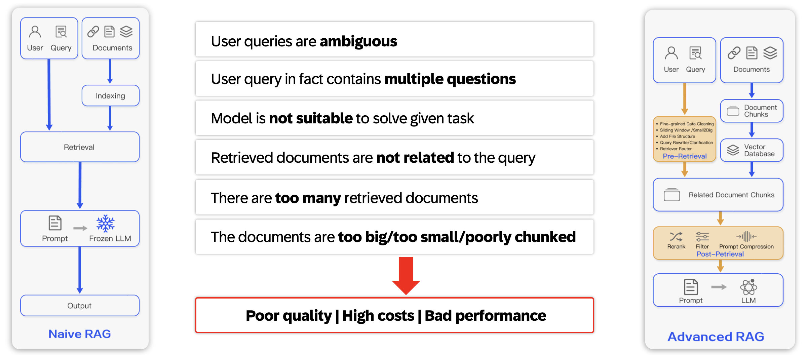
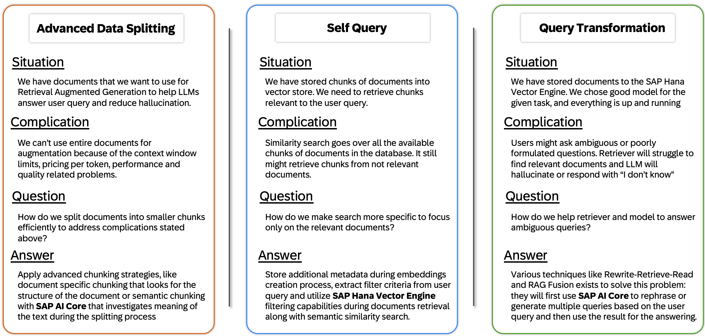

# Advanced RAG examples


Naive RAG approach covers the basics, but does not address the following:


*Image source: [Retrieval-Augmented Generation for Large Language Models: A Survey](https://arxiv.org/abs/2312.10997v1)


Advanced RAG represent a set of techniques to address this limitations.



## Installation
1. Create virtual environment

Poetry automatically creates and manages virtual environments. To create one for your project, run:

```sh
poetry install
```

This command creates a virtual environment and installs any dependencies specified in your pyproject.toml file.


2. Run the script

```sh
poetry run python main.py
```

## Data Ingestion

The examples are using LangChain to load sample documents that will be used for grounding the LLM responses.  
We download two PDF files that contain transcripts for Episode 64 and Episode 65 of SAP Podcast. After that, we will create document chunks and store embedding vectors in SAP HANA Cloud Vector Engine using the Langchain Vector store adapter. Along with the document chunks, we will store the metadata for each document chunk in the SAP HANA Cloud database. The metadata, such as podcast episode title, will be used to filter the documents during the retrieval process. We repeat the same step for SAP BTP Documentation which is used by other examples.


## Example: Splitting Data

This example shows various strategies for splitting data into multiple parts to store and use later during the retrieval process to help answer user questions:  
1. Recursive text splitter: Recursive chunking based on a list of separators. e.g. dot, new line, etc.  
1. Document specific splitter: Splitting based on the document structure. e.g. splitting based on the titles, sections, etc.  
1. Document+recursive splitter: Applying the document specific splitter first and then applying the recursive text splitter.  
1. Semantic splitter: Splitting based on the semantic meaning of the text. e.g. splitting based on the belonging parts of the text to the same topic. 

From the listed above strategies, only the semantic splitter utilizes embeddings model and requires connection to the SAP AI Core service. All the other strategies process data using local libraries.

## Example: Self Query

Retrieving relevant document for RAG can be challenging. In this example, we demonstrate how to use the SAP BTP services to implement a self-query technique that enables the retriever to query itself based on the user data before performing similarity search. This allows us to reduce the number of irrelevant documents retrieved and as a result improve the quality of the response and minimize hallucination.

First, we will extract title data from the user query. After that, we will use the title data to filter the documents stored in the SAP HANA Cloud Vector Engine during the retrieval process. The retrieved documents will be used to generate responses using the SAP GenAI Hub.

## Example: Rewrite-Retrieve-Read

In many GenAI cases users are allowed to formulate questions in a free form. That can lead to ambiguity in the question that LLMs can not understand. There are two possible outcomes out of it: LLM will guess the meaning of the query and possibly hallucinate or it will answer something like 'I don't know'. This example shows how to use the SAP BTP services to implement query rewriting to reduce query ambiguity and improve the quality of the response.

We will state ambiguous questions and see how the query rewriting service can help to improve the quality of the response. We will use langchain to retrieve the relevant documents and then use the SAP BTP services to rewrite the query. The rewritten query will be used to retrieve the relevant documents again and then the response will be generated.

## Example: RAG Fusion

In many GenAI cases users are allowed to formulate questions in a free form. That can lead to ambiguity in the question that LLMs can not understand. There are two possible outcomes out of it: LLM will guess the meaning of the query and possibly hallucinate or it will answer something like 'I don't know'. This example shows how to use the SAP BTP services to implement RAG Fusion technique. With RAG Fusion, we generate multiple queries similar to the user query, retrieve relevant documents for all of them and then combine results together using Reciprocal Rank Fusion algorithm. The final list of documents is then used to generate the response.

We use LangChain to generate multiple queries similar to the user query, retrieve relevant documents for all of them and then combine results together using Reciprocal Rank Fusion algorithm. The final list of documents is then used to generate the response. We will also compare results with and without RAG Fusion.
